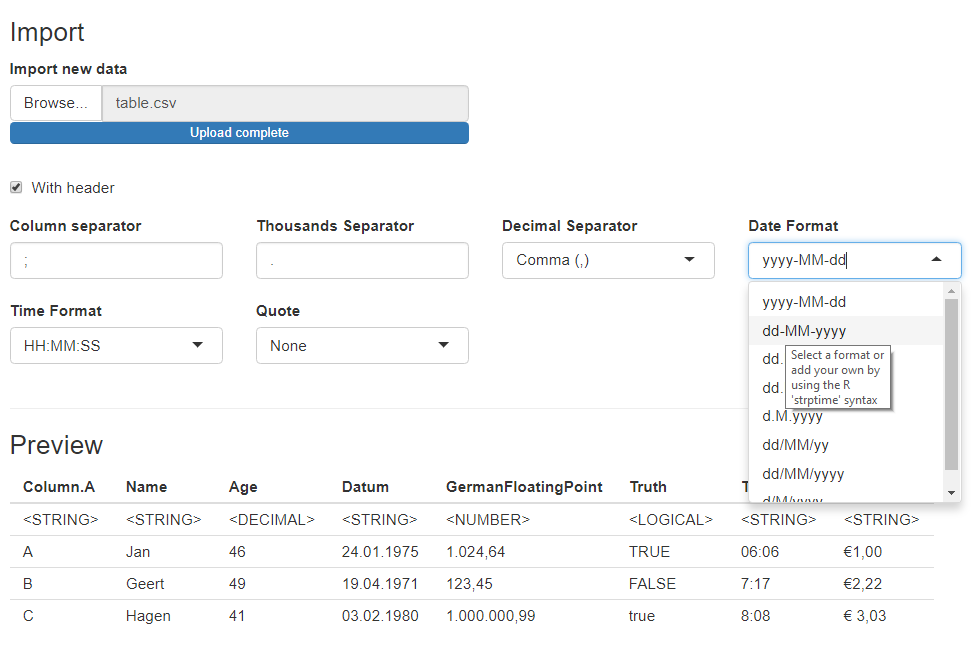

```{r, include = FALSE}
knitr::opts_chunk$set(
  collapse = TRUE,
  comment = "#>"
)
```

```{r setup, include = FALSE}
library(shiny.CSVImport)
library(knitr)
```

## What It Does

The CSV import module provides a standard user interface to read and convert a CSV file according to the users' and the apps' needs. Having selected a file, the module displays the available columns and the associated data types. The user can change the data type and specify the required format required to interpret the data correctly.

## The User Interface

Users can specify the general format of the CSV file:

 1. Does the CSV file have a column header describing variable names? Yes/No
 1. Which character separates the columns?
 3. The decimal separator
 4. Date format
 5. time format
 6. A character to qualify text


The package comes along with it's own translations. These languages are currently available:

 1. English
 2. German - Deutsch
 3. Spanish - Español (draft - I would appreciate any help here)
 4. Russian - Русский (draft - I would appreciate any help here)
 5. Korean - 한국어 (rough draft - any help appreciated)

The Spanish and Russian translation most likely need some improvement but should be clear enough to use (no promises, though).


## Available Settings

When calling the module an application can provide many options as arguments. 

* UI language (`UiLng`): use international language codes to set the desired language. 
* A set of defaults for the user-defined values needed to read the data.
* A detailed column specification:
  * Designated **column name** that the app expects.
  * The according column **name in the file**. The module will identify each column and rename them to the required specification.
  * A **data type** for each column. If no data type is given the module will guess it.
  * A **format** string that shall be used when converting the data. Format strings are required for date or time variables. If no such format is given the module will use the general format given by the user.


Available data types are based on the capabilities of the [readr package](https://rdrr.io/cran/readr/):

* `character`. An arbitrary character string.
* `number`. An arbitrary number (R type `numeric`). Correct interpretation may depend on the thousands and decimal separator.
* `integer`. Integer value. Correct interpretation may depend on the thousands separator.
* `factor`. an `R` factor.
* `logical`. a boolean/logical value.
* `date`, `time`, and `datetime`.  Correct interpretation depends on a format string (see [`strptime`](https://rdrr.io/r/base/strptime.html)).

The type `double` is available but impractical to use when importing from CSV. The module will only be able to parse these numbers when they do not have a thousands separator. It is safer to use `number`.

Two further data types have been defined that search for certain patterns in the data and return a logical value depending on the result of the search:

* `find`. Finds the text given in the format string.
* `regexfind`. Get a pattern match based on a given regular expression. The module uses Perl-compatible regular expressions because they are more commonly known compared to the `R` syntax.


## Calling the Module

The call is simple and (consistent with Shiny) you can choose any module `Id`.

```{r ModuleImportUI, eval=FALSE, include=TRUE}
ModuleImportUI("ProjectDataFile")
```


```{r ModuleImportServer, eval=FALSE, include=TRUE}
ModuleImportServer("ProjectDataFile")
```

{ width=75% }

## Specify Date & Time Format

The module depends on the capabilities of `R`. Thus, it uses the POSIX syntax to specify the expected format of date and time values.

```{r POSIX_Codes, echo=FALSE}
knitr::kable(
  read.table(sep = ";", header = TRUE, 
  text = "Code;Meaning; Example
  %a;Abbreviated weekday;Mon
  %A;Full weekday;  Monday
  %b;Abbreviated month; Jan
  %B;Full month; January
  %c;Locale-specific date and time;
  %d;Decimal date;
  %H;Decimal hours (24 hour); 14
  %I;Decimal hours (12 hour); 02
  %j;Decimal day of the year; 
  %m;Decimal month; 6 (June)
  %M;Decimal minute; 22
  %p;Locale-specific AM/PM; 
  %S;Decimal second; 56
  %U;Decimal week of the year (starting on Sunday); 3
  %w;Decimal Weekday (0=Sunday); 0
  %W;Decimal week of the year (starting on Monday); 1
  %x;Locale-specific Date;
  %X;Locale-specific Time;
  %y;2-digit year; 12
  %Y;4-digit year; 2012
  %z;Offset from GMT;
  %Z;Time zone (character);UST")
)
```


